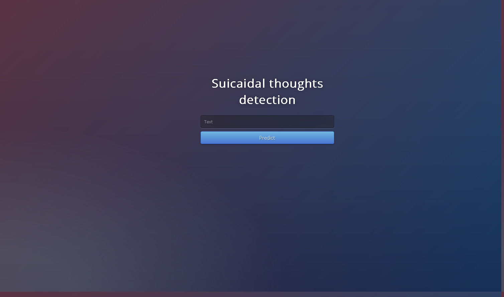

# Suicidal Thoughts Detection
## Abstract
The Saudi Arabian government is thinking of creating a suicide hotline and it wants to know what are the most frequents words/patterns in Social media posts by suicidal victims to identify them and provide the needed help to them before they harm themselves.  

## Design
The data was downloaded from [kaggle](https://www.kaggle.com/nikhileswarkomati/suicide-watch) which in turn is collected from reddit. After identifying the topic associated with suicide and extracting the important words we hope that an insight could be gained about how people with suicide think.   

## Data
The dataset contains around 230k documents, the aveargae words per document is 154 words.

## Algorithms
### Pre-processing
1.	Cleaning the text from stopwords, numbers, or anything that does not hold a meaning by itself.  

## Models
1. LSA is used for topic modeling to extract most relevant words associated with suicide.  
2. Naive Bayes is used for classifying posts.

## Model Evaluation and Selection  
### Topic modeling
1. The process of cleaning and modeling will continue untill a group of words that belongs to the desired topic is achived.  
### Classification model
1.	The dataset observations of 230k were split into 70/30 train vs. test.
2.	The evaluation of our models was based on recall for suicidal class.  

## Tools
Tools: Python, and Jupyter Notebook. 
Libraries: Pandas, Scikit-Learn, Seaborn, nltk, CloudWords.
## Communication
In addition to the slides, we made a [DashBoard](https://suicidal-thoughts.herokuapp.com/) to show our results and use the model

