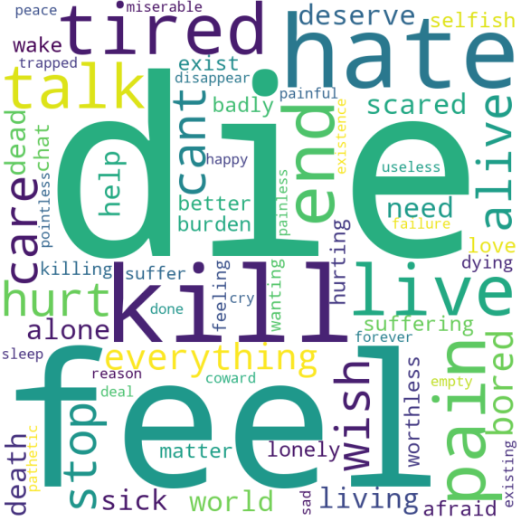

# Suicidal Thoughts Detection  
The aim of the project is to get insight into what words/feelings usually found in posts with suicidal thoughts to gain an insight about waht to look for in identifing such posts.

  

This wordcloud represent the feelings of the people who are going through suicidal thoughts, such as: despair, self loathing, lost, pain, etc... .
